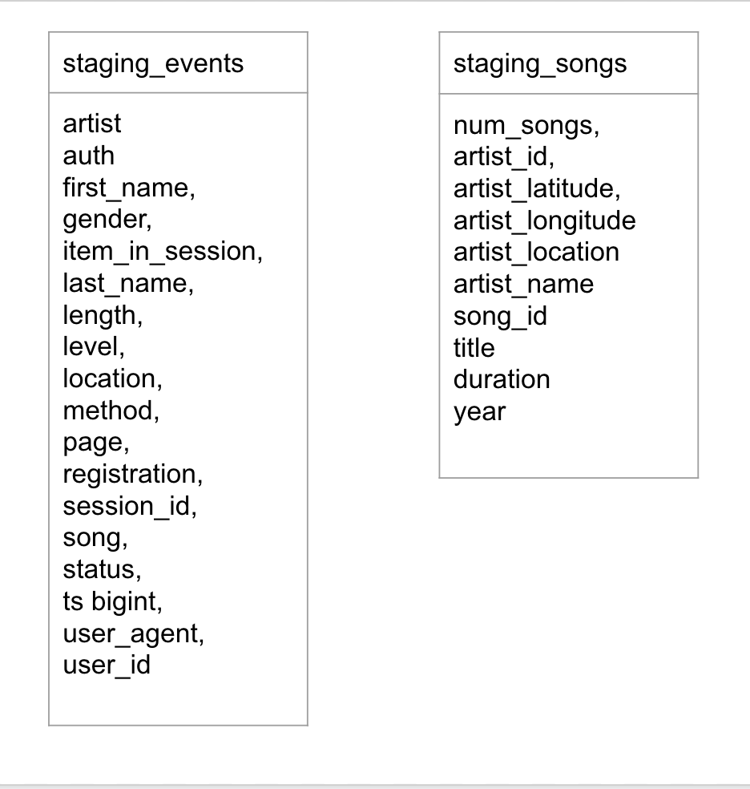
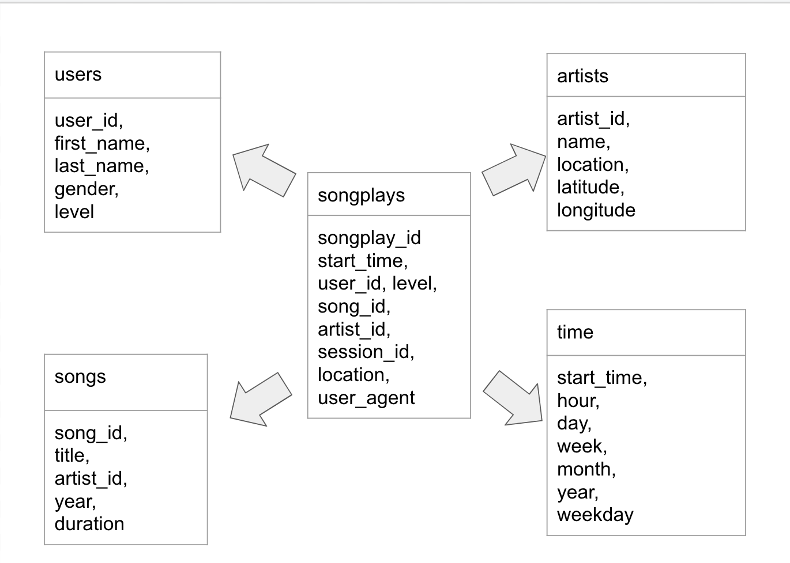
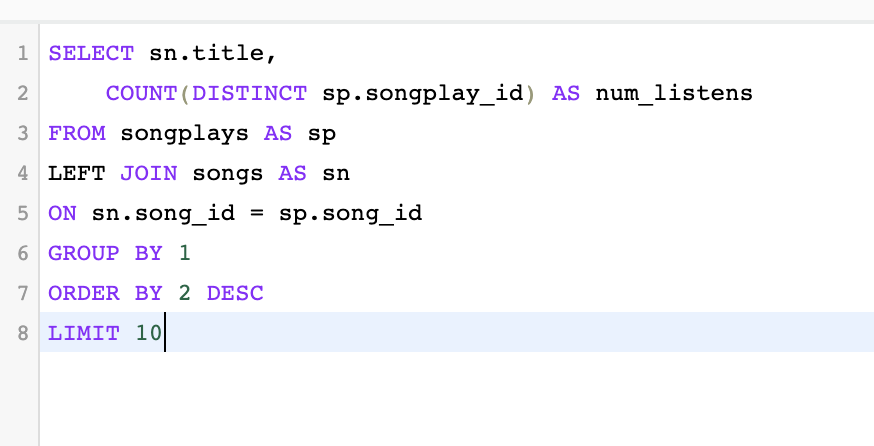

# Sparkify Data Warehouse ETL: Project Three for Udacity Nano-degress for Data Engineering

# Objective:

The objective of this project is to help a music streaming start-up called Sparkify move their processes and data into the cloud. As their data is currently held in S3 buckets, both as json logs showing user activity on the app, as well as, in a directory of metadata on the songs in Sparkify. This project is an ETL pipeline that extracts this data from S3, stages it in Redshift, and transforms the data into a star schema format for the analytics team to use. The start schema format is used because it allows quick and simpler queries to the data without having to do many joins. Thus it is more efficient. The data analytics team can now easily access the data to ask questions concerning user retention, popularity of songs and artists, popular usage times, etc.

# File Directory:

* create_tables.py - This function creates the fact and dimension tables and the staging tables.
* etl.py - This function runs the ETL pipeline; loading data from S3 into staging tables and then into the fact and dimension tables in Sparkifydb.
* sql_queries.py - This is where the sql queries are defined which will be imported into the above functions.

# Staging Tables

# Final Schema

# To Run
    * Launch an AWS Redshift Cluster (set the appropriate IAM roles and Security groups and copy all credentials into a cfg or a .env file to safely and securely use in your function calls)
    * Run create_tables.py to create database and associated tables.
    * Run etl.py to execute the pipeline which will load data from S3 into staging tables and then into the fact and dimension tables.

# Sample Query: Most popular song.

